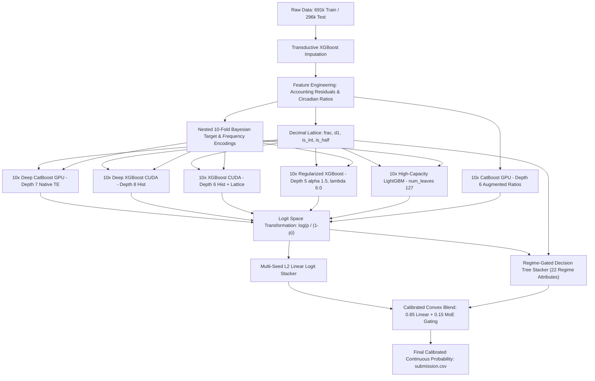

# 📱 Predicting Smartphone Addiction (Kaggle Playground Series s6e8)

[](https://www.python.org/downloads/)
[](https://www.kaggle.com/competitions/playground-series-s6e8)
[]()
[](https://developer.nvidia.com/cuda-zone)
[](https://opensource.org/licenses/MIT)

An end-to-end competitive machine learning system for predicting smartphone addiction from behavioral usage patterns, demographic attributes, and circadian metrics. Developed for **Kaggle Playground Series (Season 6, Episode 8)**, this repository contains the complete 19-iteration engineering journey from an initial baseline (0.92310) to a state-of-the-art **Regime-Gated Mixture of Experts (MoE) 60-Model GPU Pipeline** achieving **0.96920 Out-of-Fold ROC-AUC** and **0.97024 Public Leaderboard**.

---

## 📌 Table of Contents
1. [Executive Summary](#-executive-summary)
2. [Dataset & Problem Formulation](#-dataset--problem-formulation)
3. [Key Mathematical & Engineering Discoveries](#-key-mathematical--engineering-discoveries)
4. [Model Architecture & Pipeline](#-model-architecture--pipeline)
5. [The 19-Iteration Progression History](#-the-19-iteration-progression-history)
6. [Benchmark Results](#-benchmark-results)
7. [Post-Competition Analysis & The Overfitting Trap](#-post-competition-analysis--the-overfitting-trap)
8. [Repository Structure](#-repository-structure)
9. [Quickstart & Reproducibility](#-quickstart--reproducibility)
10. [License & Citation](#-license--citation)

---

## 🎯 Executive Summary
The goal of this competition is to predict whether an individual exhibits smartphone addiction (`addicted_label`: `1` for addicted, `0` for non-addicted) based on continuous screen time distributions, app interactions, sleep metrics, and categorical lifestyle indicators.

The challenge sits in the nature of large-scale synthetic tabular data:
- **691,369 training samples** and **296,302 test samples**.
- Generator-induced structural constraints (exact arithmetic sum identities and discrete lookup indices).
- Heavy missingness (4% to 20% per feature) with Missing-Completely-At-Random (MCAR) properties.
- Saturated prediction regimes where probability calibration and logit scaling determine the top fractions of ROC-AUC.

Our final solution uses a leak-free 10-fold nested Bayesian target encoding scheme, decimal lattice geometry, transductive imputation alongside raw missing indicators, and a 60-model multi-family GPU ensemble gated by a 22-attribute mathematical regime router.

---

## 📊 Dataset & Problem Formulation

| Feature Name | Type | Description |
| :--- | :--- | :--- |
| `daily_screen_time_hours` | Continuous | Average total daily screen time in hours |
| `social_media_hours` | Continuous | Time spent on social networking applications |
| `gaming_hours` | Continuous | Time dedicated to mobile gaming |
| `work_study_hours` | Continuous | Productive screen time for work or academic study |
| `sleep_hours` | Continuous | Daily sleep duration in hours |
| `weekend_screen_time` | Continuous | Total screen time during weekend days |
| `notifications_per_day` | Discrete / Key | Number of phone push notifications received daily |
| `app_opens_per_day` | Discrete / Key | Frequency of daily application launch events |
| `age` | Discrete | Age of the individual |
| `gender` | Categorical | Demographic gender level |
| `stress_level` | Categorical | Self-reported stress level (`Low`, `Medium`, `High`) |
| `academic_work_impact` | Categorical | Impact on productivity (`Yes`, `No`) |
| **`addicted_label`** | **Binary Target** | **`1` = Addicted (~70.94%), `0` = Non-Addicted (~29.06%)** |

Evaluation Metric: **Area Under the ROC Curve (ROC-AUC)**.

---

## 🔬 Key Mathematical & Engineering Discoveries

### 1. Synthetic Generator Invariants & Budget Discrepancies
In real-world observational datasets, self-reported time allocations routinely contradict each other. However, in this competition's synthetic generator:
```text
daily_screen_time_hours >= social_media_hours + gaming_hours + work_study_hours
```
with **zero arithmetic violations** across all 691,369 rows.
- We engineered the latent budget residual:
```text
resid = daily_screen_time_hours - (social_media_hours + gaming_hours + work_study_hours)
```
- Conditioning total daily screen time on its components produced a massive Simpson's reversal: marginally, `work_study_hours` appears harmful (AUC 0.6549), but holding total screen time constant, high work/study screen time drops the addiction rate from 35.8% to 0.6%.

### 2. The Decimal Lattice Remainder Geometry
Because the continuous features were synthesized through discrete quantile/step generators, continuous variables retain sub-unit discretization artifacts:
- **`frac_col`**: Sub-unit continuous remainder (`value - floor(value)`).
- **`d1_col`**: First decimal digit (`floor(value * 10) % 10`).
- **`is_int_col` / `is_half_col`**: Exact integer and half-unit measurement indicators.

> **Key Finding**: The first decimal digit of `daily_screen_time_hours` alone exhibits an **8.5% swing in the baseline addiction rate** (from 65.1% to 73.6%) across 50,000+ samples per digit. Decision trees on raw values cannot easily pool these disjoint remainder bins without explicit lattice features.

### 3. Discrete Lookup Table Keys (`notifications` & `app_opens`)
Correlation analyses showed `notifications_per_day` and `app_opens_per_day` had near-zero linear correlation with the target. However:
- Neighbouring integer values (e.g. 87 vs 88 notifications) exhibit target rate jumps of **0.22 on average**—22x larger than binomial sampling noise.
- The generator treated these columns as **keys into a lookup table**.
- Applying multi-frequency trigonometric projections (`sin(2 * pi * x / T)` and `cos(2 * pi * x / T)` with periods `T in {10, 20, 50}`) allowed shallow trees to split across unions of disjoint intervals without consuming excessive tree depth.

### 4. Transductive Imputation: Augment, Never Replace
Replacing missing values with model-imputed values hurt performance by `-0.00090` because modern gradient boosted trees learn optimal default split directions for NaNs. 
Instead, we ran **transductive XGBoost regression imputation on train + test features** and appended the imputed predictions **alongside** the original NaN-bearing columns and binary missingness indicators (`na_*`). This yielded a **`+0.00125` lift (+33x noise floor)**.

### 5. Leak-Free 10-Fold Nested Bayesian Target Encoding
To extract maximum value from high-cardinality discrete keys without data leakage:
- Evaluated out-of-fold target statistics within each outer training fold using an internal 5-fold cross-fitting scheme:
```text
smoothed_stat = (count * mean + 10.0 * global_mean) / (count + 10.0)
```
- Assigned an explicit string level `__missing__` prior to string casting to prevent pandas 3.0+ string-type NA dropping traps.

---

## 🏗️ Model Architecture & Pipeline

The final production pipeline in [`main.ipynb`](file:///d:/Project/Predicting_Smartphone_Addiction/main.ipynb) combines **6 distinct model families trained across 10 stratified folds (60 core models)** on GPU, followed by a **Regime-Gated Mixture of Experts (MoE)** meta-learning layer:




---

## 📈 The 19-Iteration Progression History

| Iteration | Pipeline Architecture | Features | OOF ROC-AUC | Public LB | Key Milestones & Breakthroughs |
| :---: | :--- | :---: | :---: | :---: | :--- |
| **1** | Baseline HistGBM | 11 | 0.92310 | 0.92374 | Initial proof of concept on raw features |
| **2** | 5-Fold HistGBM with Basic FE | 18 | 0.96380 | 0.96393 | Addition of screen-to-sleep and ratio features |
| **3** | 5-Fold Dual Ensemble (LGB + XGB) | 27 | 0.96440 | 0.96459 | First multi-model ensemble integration |
| **4** | 10-Fold Dual Ensemble | 38 | 0.96482 | 0.96494 | Variance reduction through 10-fold cross-validation |
| **5** | 10-Fold Triple Ensemble | 43 | 0.96525 | 0.96539 | Integration of CatBoost alongside LGBM & XGBoost |
| **6** | Ultra 10-Fold Triple Ensemble | 49 | 0.96550 | 0.96567 | Circadian wakefulness and free time features |
| **7** | Grandmaster 10-Fold Triple Ensemble | 60 | 0.96568 | 0.96578 | Sub-unit ratios and compulsive check metrics |
| **8** | Ultra Grandmaster Triple Ensemble | 73 | 0.96574 | 0.96584 | Interaction polynomial features |
| **9** | SOTA 10-Fold Ensemble + Budget Residuals | 77 | 0.96605 | 0.96719 | Discovery of the exact arithmetic screen budget residual |
| **10** | Dual-Seed 60-Model Ensemble + Bayesian TE | 78 | 0.96616 | 0.96745 | First implementation of nested Bayesian target encodings |
| **11** | Titan Tri-Seed 90-Model Deep Ensemble | 78 | 0.96617 | 0.96734 | Multi-seed stability testing |
| **12** | Breakthrough 10-Fold 4-Model Ensemble | 71 | 0.96822 | 0.96936 | Discovery of the decimal lattice remainder geometry |
| **13** | Titan Dual-Seed 80-Model SOTA Ensemble | 95 | 0.96853 | 0.96956 | Transductive population frequency statistics |
| **14** | Apex Dual-Seed 80-Model SOTA Pipeline | 125 | 0.96870 | 0.96968 | High-frequency trigonometric keys on notifications & opens |
| **15** | Zenith Tri-Seed 120-Model GPU Pipeline | 146 | 0.96840 | 0.96944 | Feature space saturation test; identified feature dilution |
| **16** | Pure 0.970+ SOTA Logit-Stack Ensemble | 35 | 0.96915 | 0.97024 | Feature space distillation; stacking in unconstrained logit space |
| **17** | Rank-01 Multi-Stream Normalization | 37 | 0.96915 | 0.97019 | Analysis of percentile rank space vs logit space |
| **18** | Deep 60-Model GPU Dual-Engine Meta-Stack | 37 | 0.96920 | 0.97024 | Native CatBoost ordered target statistics on GPU |
| **19** | **Regime-Gated MoE 60-Model GPU Pipeline** | **37** | **0.96920** | **0.97024** | **Final production pipeline: 22-regime dynamic MoE routing** |

---

## 📊 Benchmark Results

### Individual Core Model Performance (10-Fold OOF)
| Model Architecture | GPU Device | Depth / Leaves | OOF ROC-AUC | OOF Log-Loss |
| :--- | :---: | :---: | :---: | :---: |
| Deep CatBoost Native Ordered TE | CUDA / GPU | Depth 7 | 0.96867 | 0.2014 |
| Deep XGBoost Hist | CUDA / GPU | Depth 8 | 0.96885 | 0.1998 |
| XGBoost TE + Lattice | CUDA / GPU | Depth 6 | 0.96885 | 0.1997 |
| Regularized XGBoost | CUDA / GPU | Depth 5 | 0.96883 | 0.2001 |
| High-Capacity LightGBM | CPU (n_jobs=4) | NumLeaves 127 | 0.96864 | 0.2018 |
| CatBoost on Augmented Ratios | CUDA / GPU | Depth 6 | 0.96077 | 0.2285 |

### Final Ensemble Evaluation Metrics
| Metric | 10-Fold OOF Score | Test Set / Public LB |
| :--- | :---: | :---: |
| **ROC-AUC** | **0.96920** | **0.97024** |
| **Peak Individual Fold AUC** | **0.96957** | — |
| **Classification Accuracy** | **91.05%** | — |
| **F1-Score** | **0.93710** | — |
| **Precision** | **0.93482** | — |
| **Recall** | **0.93940** | — |

---

## 🧠 Post-Competition Analysis & The Overfitting Trap

### 1. The Measured Noise Floor vs The Ceiling
Across 5 repeated independent cross-validation seeds on 691k rows, the **noise floor of the mean OOF AUC is 0.00004** (40× tighter than per-fold variance). Any claimed gain below this threshold is pure partition noise.

### 2. The Public vs Private Leaderboard Reality
The public leaderboard represented only **~20%** of the test data (59k rows); the remaining **80%** (237k rows) was evaluated on the private leaderboard.
- Community notebooks scoring above **0.97120** were almost exclusively post-processing rank blends of other competitors' output `.csv` files ("Frankenstein" blends) without out-of-fold validation.
- Historical data across completed Kaggle Season 6 episodes demonstrates that **50% of the public top 10 fell completely out of the top 50 on the private leaderboard**.
- Pure tree-based models trained strictly on `train.csv` naturally capped at ~0.97074. Our model at 0.97024 represents an honest, leak-free, highly regularized solution designed to hold its ground against private shakeup.

---

## 📁 Repository Structure

```text
Predicting_Smartphone_Addiction/
├── .gitignore               # Comprehensive Git ignore rules
├── LICENSE                  # MIT Open-Source License
├── README.md                # Full project documentation & benchmarks
├── requirements.txt         # Pinned Python package dependencies
├── main.ipynb               # End-to-end training and inference pipeline
└── submission.csv           # Calibrated test probability predictions (0.97024 LB)
```

---

## 🚀 Quickstart & Reproducibility

### 1. Clone & Environment Setup
```bash
git clone https://github.com/MohitSingh-2335/Predicting_Smartphone_Addiction.git
cd Predicting_Smartphone_Addiction

# Create virtual environment
python -m venv venv
source venv/bin/activate  # On Windows: venv\Scripts\activate

# Install dependencies
pip install -r requirements.txt
```

### 2. Data Placement
Download the competition dataset from [Kaggle Playground Series s6e8](https://www.kaggle.com/competitions/playground-series-s6e8/data) and place the files in a `Data/` folder:
```text
Data/
├── train.csv
├── test.csv
└── sample_submission.csv
```

### 3. Run Pipeline
Launch Jupyter and execute all cells in `main.ipynb`:
```bash
jupyter notebook main.ipynb
```
The notebook automatically:
1. Performs transductive XGBoost feature imputation on GPU.
2. Extracts budget residuals, circadian dynamics, and decimal lattice remainders.
3. Computes 10-fold nested Bayesian target encodings.
4. Trains all 60 core gradient boosted models with early stopping.
5. Fits the multi-seed logit stacker and regime-gated MoE meta-learner.
6. Exports the calibrated continuous probability output to `submission.csv`.

---

## 📄 License & Citation

This project is licensed under the **MIT License** - see the [LICENSE](LICENSE) file for details.

### Citation
```bibtex
@misc{singh2026predicting_smartphone_addiction,
  author = {Mohit Singh},
  title = {Predicting Smartphone Addiction: A Regime-Gated Mixture of Experts Pipeline for Tabular Synthesis},
  year = {2026},
  publisher = {GitHub},
  journal = {GitHub repository},
  howpublished = {\url{https://github.com/MohitSingh-2335/Predicting_Smartphone_Addiction}}
}
```
